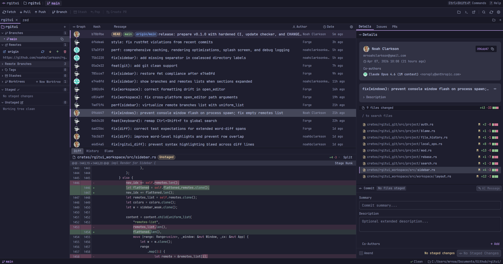

<p align="center">
  
</p>

<h1 align="center">rgitui</h1>

<p align="center">
  A GPU-accelerated desktop Git client built with <a href="https://github.com/zed-industries/zed/tree/main/crates/gpui">GPUI</a> and Rust.
</p>

<p align="center">
  <a href="https://github.com/noahbclarkson/rgitui/actions/workflows/ci.yml"></a>
  <a href="https://github.com/noahbclarkson/rgitui/releases/latest"></a>
  <a href="LICENSE"></a>
  <a href="https://github.com/noahbclarkson/rgitui/releases"></a>
</p>

<br />

<p align="center">
  
</p>

---

> [!WARNING]
> **rgitui is still in early, active development.** Expect bugs, rough edges, and breaking changes between releases. If you run into something, please [open an issue](https://github.com/noahbclarkson/rgitui/issues) — it genuinely helps.

---

## Highlights

- **GPU-accelerated** rendering via [GPUI](https://github.com/zed-industries/zed/tree/main/crates/gpui) (Zed's UI framework) — smooth 60 fps, even on large repos
- **Multi-repo tabs** — open several repositories at once and switch between them
- **Interactive rebase** — pick, squash, reword, fixup, and drop commits visually
- **AI commit messages** — optional Google Gemini integration to draft commit messages from your staged diff
- **Cross-platform** — Windows, Linux (AppImage), and macOS (Intel + Apple Silicon)

## Features

### Git operations

| Category | Operations |
|----------|-----------|
| **Working tree** | Stage / unstage / discard at file, hunk, and line level |
| **Commits** | Commit, amend, cherry-pick, revert |
| **Branches** | Create, checkout, rename, delete, switch |
| **Tags** | Create (annotated & lightweight), delete, checkout |
| **Stash** | Save, pop, apply, drop, create branch from stash |
| **Remote** | Fetch, pull, push, force push; multi-remote support |
| **Merge** | Merge with conflict detection; accept ours / theirs resolution |
| **Rebase** | Interactive rebase with pick / squash / reword / fixup / drop |
| **Bisect** | Start, good, bad, skip, reset |
| **Worktrees** | Create, list, switch |
| **Submodules** | Init, update, manage |
| **Other** | Clean untracked files, undo stack, crash recovery |

### Views

- **Commit graph** — animated lane-based visualization with Bezier-curve edges and commit search
- **Diff viewer** — unified, side-by-side, and three-way conflict modes with syntax highlighting (syntect)
- **Blame view** — per-line author info with avatars
- **File history** — commit history filtered to a single file
- **Reflog** — reference log browser
- **Global search** — full-repo search via `git grep`
- **Detail panel** — commit metadata, file list with diff stats, cherry-pick controls

### GitHub integration

- Device-flow authentication
- Create pull requests from the UI
- Browse issues and pull requests (cached with 60s TTL)

### UI

- Drag-resizable sidebar, detail panel, diff viewer, and commit panel
- Command palette (`Ctrl+P`) with context-aware commands
- Toolbar with one-click fetch, pull, push, branch, stash, create PR, and more
- Status bar showing branch, ahead/behind, staged/unstaged counts, and operation status
- Toast notifications and confirmation dialogs for destructive actions
- Animated splash screen

### Theming

Built-in themes:

- **Catppuccin Mocha** (default)
- **Catppuccin Latte**
- **One Dark**
- Custom JSON themes via the config directory

### Performance

- Pre-computed trig tables for graph rendering
- LRU caching for styled diff rows, blame, file history, and avatars
- Diff prefetching (±25 commits, 200-entry cache)
- Parallelized diff stats, stash, and worktree enumeration
- All git operations run on a background executor to keep the UI thread free

## Installation

### Pre-built binaries

Download the latest release for your platform from the [Releases](https://github.com/noahbclarkson/rgitui/releases) page:

| Platform | Artifact |
|----------|----------|
| **Windows** | `.zip` (portable) or `.exe` installer (adds to PATH, integrates with Add/Remove Programs) |
| **Linux** | `.AppImage` (recommended) or `.tar.gz` |
| **macOS Apple Silicon** | `.dmg` (aarch64) |

Each release includes a `SHA256SUMS.txt` file for verification.

> **Note:** Binaries are not code-signed. On Windows, click "More info" then "Run anyway" in SmartScreen. On macOS, right-click the app and choose "Open", or run `xattr -cr /Applications/rgitui.app` from the terminal. **macOS builds are experimental** — the `.dmg` may trigger Gatekeeper warnings. Building from source (`cargo build --release`) is reliable and recommended for macOS users.

### Build from source

**Prerequisites:**

- Rust stable toolchain

**Linux system dependencies:**

```bash
sudo apt-get install -y \
  build-essential cmake clang lld pkg-config \
  libasound2-dev libfontconfig-dev libfreetype-dev libgit2-dev \
  libglib2.0-dev libssl-dev libsqlite3-dev libva-dev \
  libvulkan1 libvulkan-dev libwayland-dev libx11-xcb-dev \
  libxcb1-dev libxkbcommon-x11-dev libxkbcommon-dev \
  libxcomposite-dev libxdamage-dev libxext-dev libxfixes-dev \
  libxrandr-dev libxi-dev libxcursor-dev libdrm-dev \
  libgbm-dev libzstd-dev vulkan-tools
```

**Build and run:**

```bash
git clone https://github.com/noahbclarkson/rgitui.git
cd rgitui
cargo build --release
./target/release/rgitui            # or: cargo run --release
```

Open a specific repository:

```bash
rgitui /path/to/repo
```

## Keyboard shortcuts

### Global

| Key | Action |
|-----|--------|
| `Ctrl+P` | Command palette |
| `Ctrl+,` | Settings |
| `Ctrl+O` | Open repository |
| `Ctrl+F` | Search commit graph |
| `Ctrl+Shift+F` | Global search (`git grep`) |
| `Ctrl+Shift+R` | Fetch |
| `Ctrl+G` | Generate AI commit message |
| `Ctrl+Enter` | Commit staged changes |
| `Ctrl+S` | Stage all |
| `Ctrl+U` | Unstage all |
| `Ctrl+B` | Create branch |
| `Ctrl+Z` | Stash save |
| `Ctrl+Shift+Z` | Stash pop |
| `Ctrl+Tab` | Next tab |
| `Ctrl+W` | Close tab |
| `F5` | Refresh |
| `?` | Shortcuts help |

### Navigation

| Key | Action |
|-----|--------|
| `j` / `k` | Move down / up in active list |
| `g` / `Shift+G` | Jump to first / last item |
| `[` / `]` | Previous / next hunk (diff) or commit (detail panel) |
| `Tab` / `Shift+Tab` | Cycle panel focus |
| `Alt+1`..`Alt+4` | Focus sidebar / graph / detail / diff |
| `Ctrl+[` / `Ctrl+]` | Resize detail panel |
| `Ctrl+Up` / `Ctrl+Down` | Resize diff viewer |
| `/` | Search in focused panel |

### Diff viewer

| Key | Action |
|-----|--------|
| `d` | Toggle unified / side-by-side |
| `p` | Toggle line-selection mode |
| `s` | Stage selected hunks/lines |
| `u` | Unstage selected hunks/lines |
| `Ctrl+C` | Copy selected lines |
| `Ctrl+A` | Select all |

### Sidebar

| Key | Action |
|-----|--------|
| `Enter` / `Space` | Activate selected item |
| `s` | Stage / unstage selected file |
| `x` / `Delete` | Delete branch, tag, stash, or discard file |

### Other views

| Key | Action |
|-----|--------|
| `b` | Open blame view |
| `h` | Open file history view |
| `d` | Switch to diff view |
| `Shift+D` | Toggle diff display mode |
| `y` | Copy commit SHA |
| `Shift+C` | Copy commit message |

## Architecture

Cargo workspace with 9 crates:

| Crate | Purpose |
|-------|---------|
| `rgitui` | Binary entry point, splash screen, window management |
| `rgitui_workspace` | Root workspace view — sidebar, toolbar, panels, dialogs, command palette |
| `rgitui_git` | Git operations via `git2` (local) and shell `git` (network), repository state |
| `rgitui_graph` | Commit graph visualization — lane layout, Bezier edges, canvas rendering |
| `rgitui_diff` | Virtualized diff viewer — unified, side-by-side, three-way conflict modes |
| `rgitui_ui` | Reusable component library — buttons, labels, badges, modals, toasts, text inputs |
| `rgitui_theme` | Theme system with semantic color tokens and JSON theme loader |
| `rgitui_ai` | AI commit message generation (Google Gemini) |
| `rgitui_settings` | Settings persistence (JSON config), keychain integration, workspace snapshots |

## Contributing

See [CONTRIBUTING.md](CONTRIBUTING.md) for development setup and guidelines.

## License

[MIT](LICENSE)
